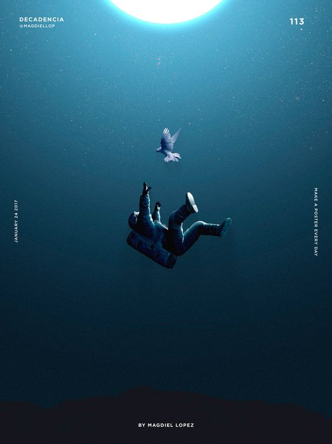
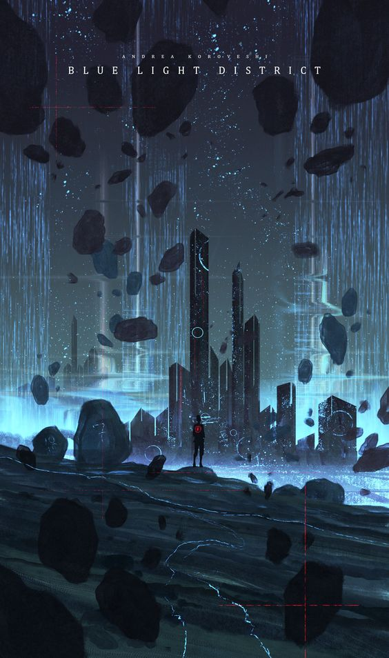

# zhli0255_tut04_groupA

## Instructions on how to interact with the work
When you open the window, the background will form a dynamic effect of semi-transparent circles slowly rising and flickering. After that, every 30 frames (which roughly translates to every second), new dynamically changing circles will appear in the foreground. They will continue to fall, and you will see a bouncing effect when they hit the window edges or collide with other circles.

## Details of individual approach to animating the group code

1. **Driving Mechanism** 

I choose Time-Based: Employ timers and events for animation. The properties of the circles change over time, creating a dynamic visual experience.

2. **Properties of the Image Animated and How to Create a Unique Animation**

My code mainly consists of two parts: **Foreground Circles** and **Background Circles**.

**Foreground Circles:**

The primary animation for the foreground circles involves **gravity and bouncing**. Foreground circles are animated to move downwards due to gravity and bounce off the edges of the canvas and each other. This creates a dynamic, constantly changing arrangement of circles. Over time, new circles continuously appear until the screen is filled, at which point refreshing the screen will restart the process. The colors within the circles flicker due to constant changes, adding to the dynamic visual effect.

**Background Circles:**

The primary animation for the background circles involves **position and movement**. Background circles move slowly upwards. When a circle moves off the top edge of the canvas, it reappears at the bottom. Additionally, the circles have varying levels of transparency, creating a flickering effect.

The animation created by these two elements is based on the combination of the time-based addition of new circles and the dynamic movement of existing circles, ensuring a constantly evolving scene. The flickering effect of both the foreground and background circles creates a unique visual experience. The falling foreground circles simulate a realistic sense of space within the window.

3. **Inspiration**

My inspiration comes from two sources studied during week 8: a poster named **"Space" by Magdiel Lopez** and a digital artwork named **"Blue Light District" by Andrea Koroveshi**. I was particularly drawn to the floating and falling elements in these works. Additionally, I incorporated ideas from a small game called **"Suika Game"** which simulates the feeling of fruits falling and colliding. This combination of influences helped shape the floating and bouncing effects in my animation.

- Space

- Blue Light District

- Suika Game

[Suika Game Play link](https://g.lisagame.com/game/407/)

4. **Technical Explanation of Code**

Changes made to the group's code base

- **Adjust the constructor of the `Circle class`**

Added initialization of initial velocity and gravity to simulate realistic motion effects.

- **Add `update()`**

Used to update the motion state of the circle, including gravity effects, collision detection, and position updates.

- **Delete `noLoop()`**

Ensured the draw function is called every frame to maintain continuous animation.

- **Add array of background circles**

Introduced backgroundCircles array and `createBackgroundPattern()` to initialize and store data for background circles.

Implemented `drawBackgroundPattern()` to draw background circles, adding transparency changes and a slow upward movement effect.

- **Modify the `setup()` and `draw()`**
In the `setup()`, use `createBackgroundPattern()` to initialize the background.

In the `draw()`, use `drawBackgroundPattern()` and `drawForegroundCircles()` to draw the background and foreground circles, respectively.

- **Add the `windowResized()`**

The animation can be adjusted in real time according to the window size.

## Code comments
More detailed explanations and references for the code's functionality are annotated within the **sketch.js** file. Please refer to the comments in the code for further insights.